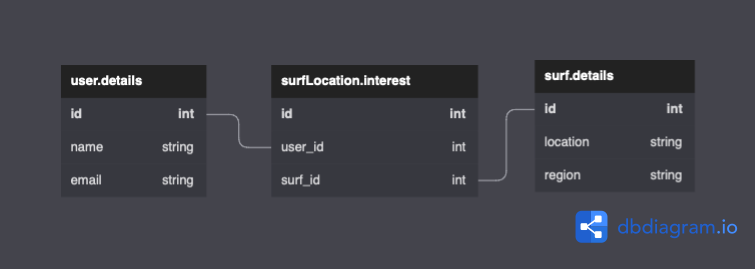

# Database Architecture
This document discusses the design of the database and why the approach was 
taken.

## High Level Overview

In the image above it shows the current design of the database. As seen
three tables are needed. One for the user, the surf location/region and
then the surf location interest. The surf location interest table connects
the user to the location together. This design is known as the
["Entity–attribute–value model"](https://en.wikipedia.org/wiki/Entity–attribute–value_model).
This was done as it allows for many entries to be added to the table
relating the user to the locations they are interested in. Further
discussion to why this approach was taken is found under the heading
**User Table**.

## Table Design
### User Table
The user table contains all the information relevant to the user. This
includes their name and email. It would have been possible to add the
places they want to be notified here, but there would have been a few
complications with that. Having one location is doable but that limits the
program especially if the user is interested in multiple places. It would
be possible to add a new field for every place a person is interested in
but that would be a poorly designed database.

In this design the id is the primary key, however, it may be changed to the
email as that is a unique identifier. The name of the user was not selected
as there is a chance there may be multiple users with the same name.

### Surf Details Table
The surf details table contains relates the surf location to the region it
resides in. It uses an integer value as its primary key, however, the
location could become the primary key as it should be unique. But, if this
program expands and there are more locations added there is a likelihood
that the name of the location is not unique and so it would be better to
use an integer id.

### Surf Location Interest Table
This links the surfer to the location they are interested in. The table
will keep on adding entries as more users/locations of interest are added.

