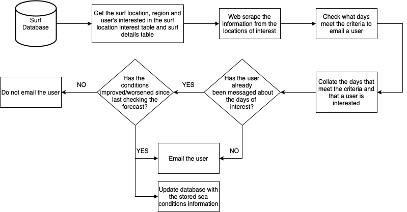

# Programme Design
This document outlines how the programme will work.

## Overview
This chart shows the flow diagram of how this programme will operate. The
heart of this programme is the database as it stores all the information
that is necessary to scrape the data as well as who to message.

It will start off by grabbing the information regarding the surf
locations that users are interested in. Then it will go on to the website
and scrape the data from the relevant locations. Once all the data is
collected it will check if the criteria is met to notify someone about the
day(s) and location(s) to surf. After this it should update a table in the
database that knows which location(s) and days(s) that users have been
notified about. If the conditions have worsened it should notify the users
that it is not recommended for them to go surfing on that day.

## Cron Job
The cron job will run the 'run_web_scraper.sh' script once a day, daily.
This should be often enough to update the user and tables if the forecast
changes for upcoming dates.

Personally, I will be running this cron job on my Raspberry Pi 4. To
create/access the cron job, you should enter `crontab -e` in the terminal.
**WARNING:** Ensure you enter the command correctly. Do not enter`crontab
-r` as that will delete your cron jobs.

The following line will be entered in the cron tab to run the scripts:  
`0 5 * * * /path-to-script/surf-emailing-automator/run_web_scraper.sh`  
This will make the script run at 5AM every day.

## Web Scraper
The browser used as part of this programme is Firefox. The reason being it
is not as resource intensive in comparison to Chrome which is another
common web browser.

## Emailer
To send the details to those who are interested a new email account was 
created. This is so no private information will be shared publicly. 
This is because as part of the script it will log in to this account and 
send the emails. The details of this account (and the accounts of those who 
want to be emailed) will be kept in a private database that will not be 
pushed into this repo. This will be done by adding the name of the database 
file to the `.gitignore` file.   